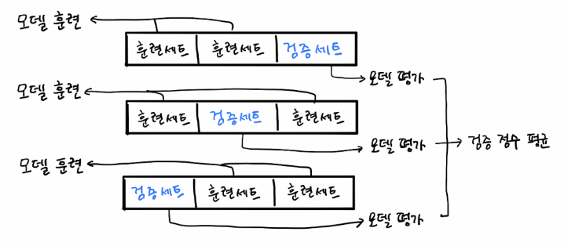
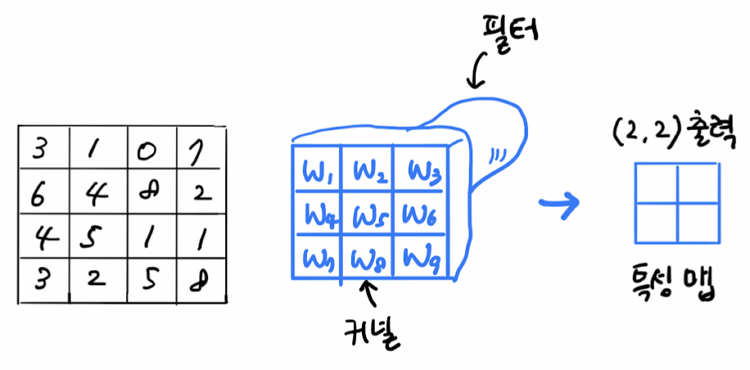
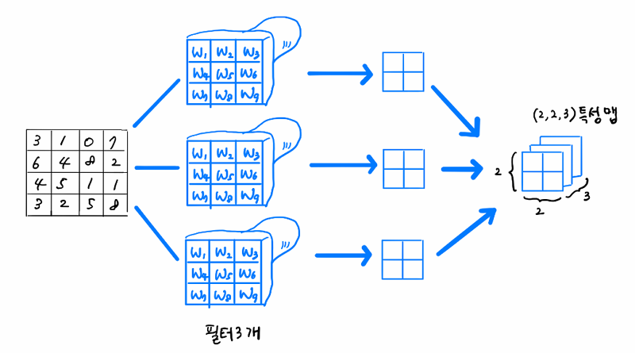
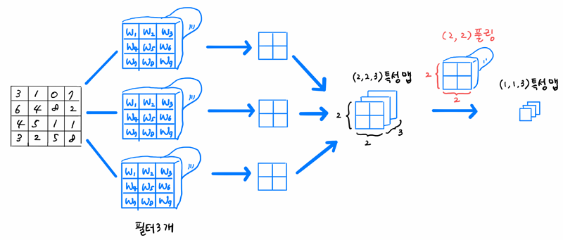
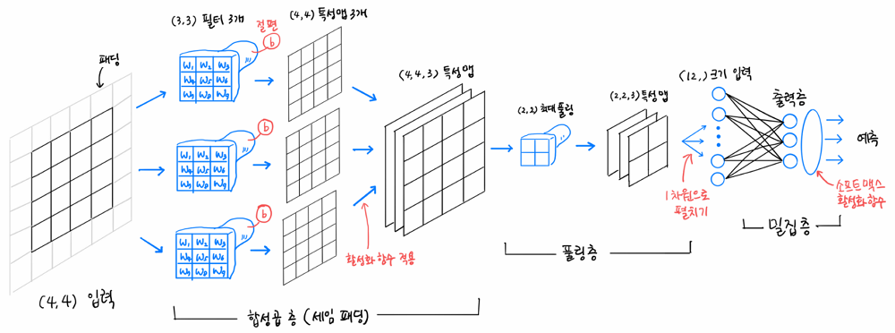
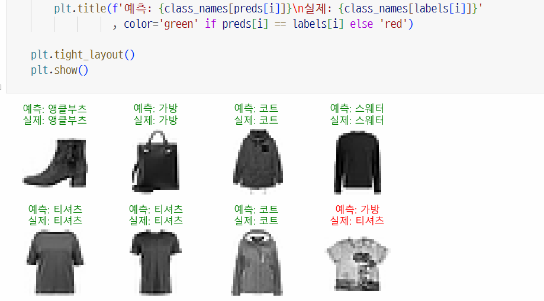
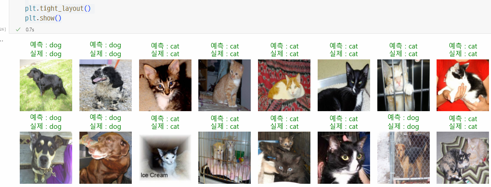

# iot-dataanalysis-2025
2025 IoT 개발자과정 빅데이터분석 리포지토리

## 1일차

### 머신러닝/딥러닝


(출처 : NVIDIA)

- 인공지능(Artificial Intelligence: AI)의 분야
    - 컴퓨터가 사람의 행동을 흉내내는 모든 기술

- 머신러닝
    - 인공지능 하위 집합
    - 통계적 방법을 이용, 기계를 학습시키는 인공지능 기술

- 딥러닝
    - 머신러닝의 하위 집합
    - 신경망 기술을 이용, 머신러닝 기술 중 하나

- 인공지능 역사
    - 1943 - MCP뉴런 이론
    - 1950 - 튜링(앨런 튜링) 테스트, 인공지능 테스트
    - 1957 - 퍼셉트론 이론
    - 1974 - 1차 AI겨울. 컴퓨터 성능 한계
    - 1980 - AI붐. 전문가 시스템(머신러닝)
    - 1987 - 2차 AI겨울. 전문가 시스템 실패
    - 2010 - 컴퓨팅 HW환경 비약적 발전. AI희망
    - 2015 - 텐서플로 발표
    - 2016 - 알파고

### 개발환경

#### 코랩
- Google Colaboratory, 2017년 발표
- 구글에서 만든 온라인 주피터노트북 개발 플랫폼
- 구글 드라이브 연동, 구글 서버 하드웨어 사용
    - 드라이브 ColabNotebooks 폴더에 저장
- 어디서나 파이썬 학습, 개발 등 가능
- https://colab.research.google.com/?hl=ko 
- 런타임 유형
    - CPU, T4 GPU, v2-8 TPU - 무료
    - A100 GPU, L4 GPU, v5e-1 TPU - 유료
- 무료에서는 80분 넘어서면 세션이 끊어짐

#### VSCode
- 로컬 직접 환경 설정
- 사이킷런, 텐서플로, 쿠다, 파이토치...

##### 파이썬 가상환경
- 가상환경 생성 명령어
```shell
> python -m venv mlvenv
```
- 가상환경 사용
```shell
> .\mlvenv\Scripts\activate
(mlvenv) PS C:\Source\iot-dataanalysis-2025>
```

- 가상환경은 깃허브에 올라가지 않도록 처리
- .gitignore에 /mlvenv 추가 후 깃허브 우선 푸시

- 맷플롯립(Matplotlib) 설치
```shell
> pip install matplotlib
```

- 맷플롯립 한글 설정
```python
import matplotlib.pyplot as plt
import seaborn as sns

# 한글로 Matplotlib 사용시 항상 필요
from matplotlib import rcParams, font_manager, rc

font_path = 'C:/Windows/Fonts/malgun.ttf'
font = font_manager.FontProperties(fname=font_path).get_name()
rc('font', family=font)
rcParams['axes.unicode_minus'] = False

sns.set_style('darkgrid')
sns.set_theme(font='Malgun Gothic', rc={'axes.unicode_minus': False})
```

- 시본(Seaborn) 모듈(맷플롯립 하위 모듈) 설치
```shell
> pip install seaborn
```

- 사이킷런(sklearn) 설치
```shell
> pip install scikit-learn
```

- 텐서플로(Tensorflow) 설치
```shell
> pip install tensorflow==2.15.0
```

### 첫번째 머신러닝
- 캐글 생선 데이터
    - https://www.kaggle.com/datasets/vipullrathod/fish-market

- 길이를 보고 도미(bream)인지 빙어(smelt)인지 판별
- 이진 분류(Binary Classification)

- [노트북](./day01/mldl01_도미빙어분류.ipynb)

### 지도 학습/ 비지도 학습
- 지도 학습(supervised learn) - 데이터 -> `입력`, 정답 -> `타겟` => 훈련 데이터(training data)
    - 입력 - 특성(길이, 무게, ...)
    - 입력과 타겟을 모두 주어서 훈련을 시키는 것
- 비지도 학습(unsupervised learn) - 입력만 존재하고 타겟이 없이 훈련하는 것
- 강화 학습(reinforcement learn) - 선택가능한 행동 중 보상과 처벌 등으로 최적의 행동양식 학습하는 것

#### 훈련 세트/테스트 세트
- `훈련` 세트 - 모델을 훈련시키 위한 데이터 
- `테스트` 세트 - 훈련 후 모델이 예측을 제대로 하는지 테스트하는 데이터

- 전체 데이터 70~80퍼센트 분리 후 훈련 세트로, 20~30퍼센트를 테스트 세트 사용

#### 샘플링 편향
- `샘플링 편향`
- 49개 데이터를 7:3으로 분리하면
    - 34마리가 전부 도미로 훈련 세트
    - 1마리 도미 + 14마리 빙어로 테스트 세트

- 위 문제를 해결하기 위해서 데이터를 랜덤하게 섞어 줌

#### 넘파이
- 수학 라이브러리 일종. 파이썬에서 배열처리 쉽게 도와주기 위해 개발
- 2차원 배열이상 고차원 배열 조작 처리 간편한 도구

- [노트북](./day01/mldl02_훈련테스트세트.ipynb)

## 2일차

### 빅데이터에 필요한 모듈
- Numpy(배열), Pandas(데이터 조작), Matplotlib(차트), Seaborn(차트꾸미기), 
- Folium(지도), Faker(더미데이터)

- [노트북](./day02/mldl01_주요모듈학습.ipynb)

### 데이터 전처리
- 머신러닝/딥러닝 이전에 데이터 가공

- [노트북](./day02/mldl02_데이터전처리.ipynb)

### 선형회귀
- 회귀(Regression) : 두 변수 사이의 상관관계를 분석하는 방법
    - 임의의 수치를 예측하는 문제

- `과대적합` - overfit. 모델 훈련세트 성능이 테스트세트 성능보다 훨씬 높을때. 
- `과소적합` - underfit. 훈련세트 성능 낮거나, 테스트세트 성능이 너무 높을때.


- K-최근접 이웃 회귀 알고리즘 문제점 확인


- 선형회귀 중 직선(1차 방정식)의 문제점 확인

## 3일차

### 선형회귀 중 다항회귀

#### 선형회귀 중 단항회귀 문제점
- 예측값이 마이너스 나오는 경우 발생(물고기 무게 등), 오차 발생

#### 다항회귀
- 단항회귀 문제를 해결
- 무게 = a x 길이^2 + b x 길이 + c
    - 회귀선이 곡선으로 표현

- [노트북](./day02/mldl03_선형회귀.ipynb)

#### 특성공학
- 훈련시킬 특성이 모자랄때 기존 특성을 조합해서 새로운 특성을 만드는 과정
- `sklearn.preprocessing.PolynomialFeatures` 를 사용해서 특성을 추가
- `하이퍼파라미터` - 머신러닝, 딥러닝에서 학습하지 않는 파라미터
    - 사람이 직접 지정하는 값
    - random_state, learning_rate, ...

### 로지스틱회귀
- 선형(다항)회귀 - 특성을 입력해서 타겟값을 예측
- 로지스틱회귀 - K-NN 분류처럼 분류 알고리즘
    - 분류를 확률로 예측

- K-최근접 이웃 분류 알고리즘
    - 다중 분류가 어려움
    - 범위를 벗어난 데이터는 예측에 불리

- 선형 방정식으로 학습
    - 무게, 길이, 대각선길이, 높이, 두께 특성
    - z = a x 무게 + b x 길이 + c x 대각선길이 + d x 높이 + e x 두께 + f
    - z : 0~1(0~100%) 

#### 활성화함수
- 활성화함수 - 입력신호를 출력신호로 변환시켜주는 함수
    - `시그모이드함수` - z가 아주 큰 음수일때 0으로, z가 아주 큰 양수일때 1로 바꿔주는 함수. 이진분류

        

    - `소프트맥스함수` - 다중분류에서 z값을 확률로 만들어주는 함수

- [노트북](./day03/mldl01_로지스틱회귀.ipynb)

- 현재까지 K-NN분류, 선형회귀, 로지스틱회귀 학습

#### 머신러닝이 많이 활용되는 분야
- 인터넷쇼핑/이커머스
    - 추천시스템 : 유저 행동을 분석해서 상품추천 
    - 가격최적화 : 수요에 맞게 가격을 자동 조정
    - 고객 이탈 예측 : 고객이 언제 서비스를 떠날지 예측하고 방지

- 금융서비스 범죄쪽 예측
    - 신용점수 평가, 이상거래 탐지, 보험사기 예측
    - 핀테크

- 제조/공정 자동화(스마트팩토리)
    - 불량품탐지(Vision) : 카메라 이미지로 실시간 불량 예측
    - 예지보전 : 기계 고장을 사전에 예측. 미리 수리
    - 생산 최적화 : 공정을 손봐서 품질 향상 자동화

- 의료/헬스케어
    - 질병예측
    - 의료영산분석 : CT, MRI 자동 종양탐지

- 자율주행/로봇
    - 객체인식 및 추적 : 카메라, 라이다로 차량, 사람인식
    - 경로 계획 : 최적 주행경로 계산
    - 행동예측 : 앞차나 보행자의 움직임을 예측

- 보안 
    - 침입탐지시스템, 악성코드분류, 화재인식...

### 확률적 경사하강법 - SGD
- `확률적 경사 하강법`(Stochastic Gradient Descent)를 사용하는 이유
    - 데이터가 너무 많을때 시간절약
    - 로컬 미니마(지역 최소점) 문제 해결
    - 데이터가 계속 쌓이면, 이전 모델에 사용된 데이터 필요하고 새 데이터도 필요
    - 모든 데이터로 학습을 하면 시간이 낭비

- SGD 설명 정리
    - 머신러닝이 하나의 문제를 예측하고
    - 정답과 비교해서 얼마나 틀렸는지 확인한 다음
    - 살짝 방향을 틀어서 다음에는 덜틀리게 만드는 방법

- `에포크`(epoch)
    - SGD로 훈련세트를 한번 다 사용한 과정. 반복횟수

- 경사하강법 종류
    - `확률적 경사하강법` : 주어진 간격대로 1개씩 꺼내서 하강시키는 방법
        - `batch_size` 배치크기 1, 한개의 샘플로 손실계산. 빠름
        - sklearn에서는 이것만 지원
    - `미니배치 경사하강법` : `배치`(한 번에 사용하는 데이터 묶음)로 꺼내서 하강시키는 방법
        - 배치크기 32, 64, 128 단위로 처리. 빠르고 안정적, GPU처리 적합
    - `배치` 경사하강법 : 필요한 데이터를 몽땅 한번에 꺼내서 하강시키는 방법
        - 메모리 많이 사용, 느림

#### 손실함수
- 얼마나 틀렸는지 점수를 매기는 도구 
    - 내 예측이 얼마나 틀렸는지 숫자로 계산하는 것
    - 손실값(벌점)
- `비용함수` - 손실함수와 거의 똑같이 사용하는 이름
- `손실함수` - 머신러닝 알고리즘이 얼마나 엉터리인지 측정하는 기준 함수
    - 값이 가장 최소일때 오류가 제일 적음

    - 로지스틱 손실함수(이진 크로스엔트로피) 또는 로그 손실

        

        - y : 실제 정답(0 또는 1)
        - $ \hat{y}$ : 예측 확률(0 ~ 1 사이)

        - 정답이 1일때 (y=1)
            - 예측이 1에 가까우면 -> 손실작음(good!)
            - 예측이 0에 가까우면 -> 손실 큼(bad~)
        - 반대도 동일
    - 크로스엔트로피 손실함수

- [노트북](./day03/mldl02_확률적경사하강법.ipynb)

## 4일차

### 교차검증과 그리드 서치
- 개요
    - 기본적으로 훈련세트와 테스트세트로 나눠서 훈련과 확인을 수행
    - 테스트세트를 사용하지 않으면 과대적합,과소적합을 판단하기 어려움
    - 원본데이터를 8:2 또는 7:3 정도로 훈련세트와 테스트세트로 분리

- `검증세트` : 테스트세트를 사용하지 않고도 적합측정하는 기법에 사용하는 데이터세트

    

    - 원본에서 8:2로 훈련세트와 테스트세트로 나눈뒤
    - 훈련세트를 10%를 검증세트로 다시 분리

- 교차검증
    - 검증세트 만들면서 훈련세트 데이터수가 줌
    - 검증세트를 떼어 내어 검증(평가)하는 과정을 여러번 반복하는 것

    

    - sklearn.model_selection.cross_validate, sklearn.model_selection.StratifiedKFold 사용

- 그리드서치
    - 하이퍼파라미터 : 인공지능처리시 사용자(개발자)가 직접 지정해야되는 매개변수
        - 랜덤시드, 반복횟수, 손실함수, 훈련률, ...
    - AutoML : 하이퍼파라미터를 기계가 직접 처리하는 머신러닝
    - 하이퍼파라미터를 편리하게 관리해주는 도구

### 딥러닝, 인공신경망
- 인공신경망 : ANN(Artificial Neural Network)
- 딥러닝 : 인간의 뇌를 모방하여 훈련시키는 머신러닝 기법
    - 이미지, 영상, 음성, 텍스트 처리에 뛰어난 성능 발휘

- 밀집층 : 가장 간단한 인공신경망, 1개의 Layer를 의미
- fashion MNIST 사용해서 실습

- [노트북](./day04/mldl01_딥러닝_인공신경망.ipynb)

### 심층신경망
- 심층신경망 : DNN(Deep Neural Network)
- 2개 이상의 밀집층으로 구성된 인공신경망
- 은닉층 : hidden layer. ReLU 활성화 함수 사용
- 옵티마이저 : 신경망의 가중치, 절편을 제대로 학습하기위한 알고리즘. Adam클래스 사용
- 드롭아웃 : 일부 뉴런을 꺼서 훈련을 덜 시키는 것. 과대적합 방지
- 콜백 : 훈련 도중 다른 일 수행할때 사용

- [노트북](./day04/mldl02_딥러닝_심층신경망.ipynb)

## 5일차

### 합성곱신경망
- 합성곱신경망 : CNN(Convolution Neural Network)
    - 필터로 도장을 찍듯이 특성을 뽑아내어 사이즈를 줄여가며 훈련을 하는 신경망

    

- 기본용어
    - `커널`(필터) - 입력에 곱하는 가중치 도장. 뉴런의 개수를 필터라고 부름
    - `특성맵` - 합성곱 계산(각 커널과 입력을 곱한 출력)으로 구해진 출력값

- 각각의 가중치로 특성맵을 여러번 생성

    

- 기본용어
    - `패딩` - 입력이미지 테두리로 0을 채워서, 합성곱계산 후로 입력과 동일한 사이즈의 특성맵을 만드는 방법. 0을 채우는 걸 세임 패딩, 순수 입력으로 합성곱하는 걸 밸리드 패딩
    - `스트라이드` - 커널 도장을 찍는 이동크기. 보통 1로하고 2이상으로 하면 세임패딩을 하더라도 특성맵의 사이즈가 줄어듬
    - `풀링` - 만들어진 특성맵의 크기를 줄이는 작업 수행. 보통 최대풀링을 많이 사용

    

- 합성곱신경망 전체 구조

    

- 이미지 처리시 머신러닝 로지스틱 회귀 분류로도 가능하고
- 딥러닝 기본 신경망으로도 가능했음
- 합성곱 신경망으로 훈련하고 예측하는 것이 좀더 정확도 높음

- [노트북](./day05/mldl01_케라스_합성곱신경망.ipynb)

### 파이토치 맛보기
- 파이토치 시작하기

- [노트북](./day05/mldl02_파이토치시작.ipynb)

## 6일차

### 파이토치 기본학습
- 파이토치 기본

- [노트북](./day06/mldl01_파이토치_기본.ipynb)

### 파이토치 실습
- 파이토치로 Fashion-MNIST 실습
- Keras CNN과 비교해서 학습할 것!

- [노트북](./day06/mldl02_파이토치_합성곱신경망.ipynb)

    

## 7일차

### 토이프로젝트
- Cats and Dogs 이진분류 실습
- 캐글에서 코딩하는 법

- [노트북](./day07/mldl01_Cats_and_Dogs_이진분류.ipynb)

- 훈련세트로 예측결과

    

- Kaggle 참조노트북
- [노트북](./day07/zzaebok-cat-vs-dog.ipynb)

## 8일차

### YOLO
- YOLO(You Only Look Once) - 객체 탐지, 이미지 분할 등을 위한 딥러닝 모델
    - 2015년 배포. 
    - 이미지를 영역 나눠, 각 영역에 대한 경제 상자와 확률을 예측
    - 이미지 인식, 로봇, 자율 주행, 스마트 CCTV 활용 중
    - 스마트 CCTV : 자동차사고, 화재경보 등 사고 즉시 파악 예보

- 최초 공식사이트 : https://pjreddie.com/darknet/yolo/
- 2020년 파이토치 기반 변경(YOLOv5) : https://www.ultralytics.com/ko 
- 2025년 현재 v12(beta), v11(stable)

- [노트북](./day08/mldl01_YOLO_start.ipynb)

### 코딩테스트
- 코딩테스트 